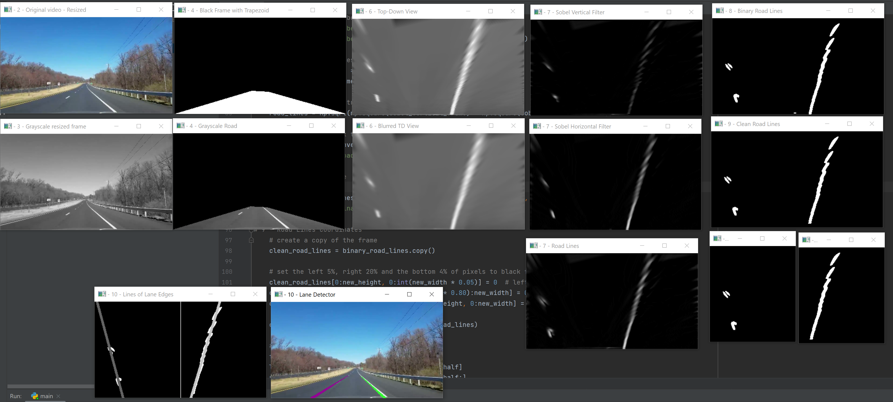

# Road Lane Detection

This repository contains the implementation of a lane detection system written in Python. The project utilizes a video input to detect and highlight driving lanes, providing a foundational approach to understanding lane detection technologies commonly used in autonomous vehicles and driver assistance systems.

## Getting Started

### Prerequisites

- Python 3.8 or newer
- OpenCV library

### Installation

To set up the project environment:

1. Install Python from Python.org.
2. Install OpenCV using pip.

### Running the Program

Ensure the video file `Lane_Detection_Test_Video_01.mp4` is in the same directory as the script or update the path in the script accordingly.

## Features

- Video processing to detect lanes.
- Real-time lane highlighting.

## Technologies Used

- Python: Main programming language.
- OpenCV: Open Source Computer Vision Library for image processing tasks.

## Acknowledgments

- Inspiration from basic lane detection principles.

## Images

